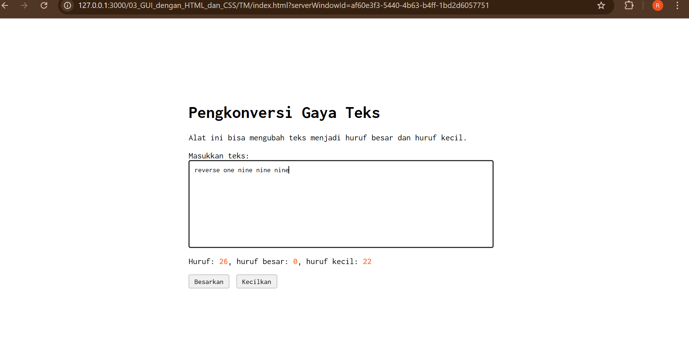
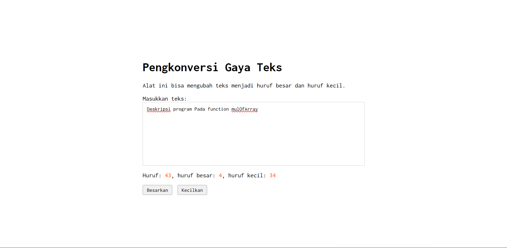
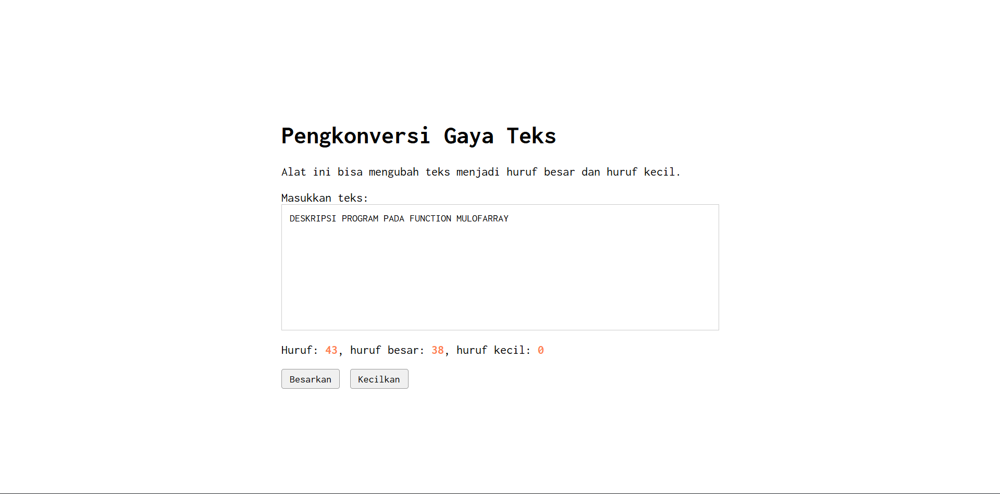

# Tugas Mandiri: GUI dengan HTML dan CSS

Muhammad Akbar Ivanka

103122400069

SE-08-02

Dosen Pengampu: Yudha Islami Sulistiya

Asisten Praktikum: Adhiansyah Muhammad Pradana Farawowan, Hamid Khaeruman

## Soal

Setelah kamu menyelesaikan tugas pendahuluan (bisa buka di atas), terapkanlah fungsi untuk (1) menghitung huruf kecil yang disediakan di #hk, (2) mengubah huruf kecil ke huruf besar ketika pengguna menekan tombol #huruf-besar, dan (3) mengubah huruf besar ke huruf kecil ketika pengguna menekan tombol #huruf-kecil.

## Kode Sumber

Tersedia di [index.html](./index.html), [index.css](./index.css) dan [index.js](./index.js)

## Output

## Deskripsi

di file HTML-nya aku udah ngehapus tombol dan deskripsi 'Paragrafkan' karena memang disuruh dihilangin dari alatnya. Terus di CSS, aku cuma nambahin sedikit margin di tombol-tombolnya biar jaraknya lebih enak dilihat dan nggak berdempetan.

di file HTML-nya aku udah ngehapus tombol dan deskripsi 'Paragrafkan' karena memang disuruh dihilangin dari alatnya. Terus di CSS, aku cuma nambahin sedikit margin di tombol-tombolnya biar jaraknya lebih enak dilihat dan nggak berdempetan.

untuk TM ini udah tak sesuain kodenya sama instruksinya. untuk file HTML nya udah  kuhapus tombol dan deskripsi 'Paragrafkan'. Terus di CSS, cuma nambahin sedikit margin ditombolnya biar jaraknya lebih enak aja diliat

lalu, buat logicnya di JS, kubikin satu fungsi updateCounters biar bisa ngitung jumlah karakter secara real time/nyata tiap kali kita ngetik. Buat misahin hitungan huruf kecil dan huruf besar, aku pake Regex /[a-z]/g dan /[A-Z]/g. Jadi, angka atau spasi nggak bakal ikut kehitung sebagai huruf. Terakhir, aku pasang event listener di tombol 'Besarkan' dan 'Kecilkan' pakai fungsi bawaan toUpperCase() dan toLowerCase(). Jadi pas tombolnya diklik, teksnya bakal langsung berubah ukuran, dan fungsi hitungnya otomatis kepanggil lagi biar angka di layarnya tetap update dan akurat."