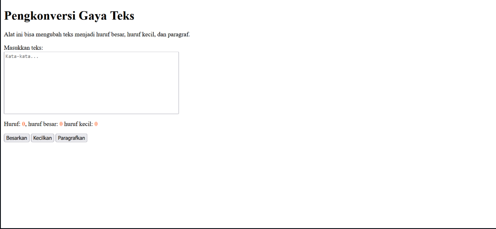
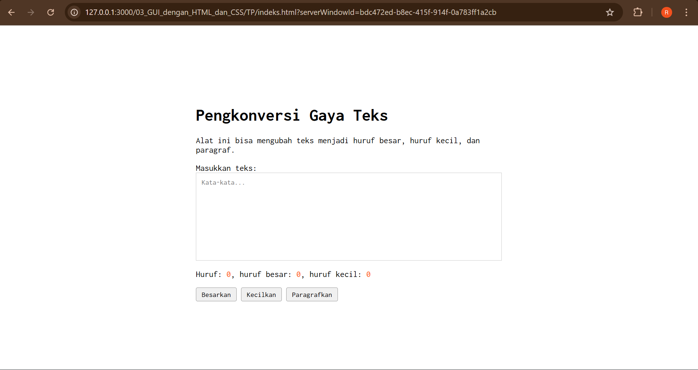

# Tugas Pendahuluan: GUI dengan HTML dan CSS

Muhammad Akbar Ivanka

103122400069

SE-08-02

Dosen Pengampu: Yudha Islami Sulistiya

Asisten Praktikum: Adhiansyah Muhammad Pradana Farawowan, Hamid Khaeruman

## Soal

Buatlah tata letak laman yang kamu buat berada di tengah seperti di bawah ini, dan juga ubah font-nya dengan Inconsolata dari Google Fonts.

## Kode Sumber

Tersedia di [index.html](./index.html), [index.css](./index.css) dan [index.js](./index.js)

## Output

## Deskripsi

Di kode HTML, nambahin link dari Google Fonts di bagian <head>. Kalau sebelumnya masih pakai font bawaan browser, sekarang pake font "Inconsolata" biar tampilannya sesuai permintaan soal. Selain itu, nambahin tag 
 dengan class container buat ngebungkus semua konten, karena tanpa pembungkus ini,bakalan susah buat nentuin batas lebar kontennya pas udah dipindah ke tengah.

Terus, perubahan paling besar ada di file CSS, terutama di bagian body. Di kode sebelumnya, elemen-elemennya pasti masih numpuk di pojok kiri atas secara default. Nah, di kode yang baru, pake Flexbox: display: flex, justify-content: center, dan align-items: center. Biar bisa ada di tengah layar secara vertikal, ditambahin min-height: 100vh. Tanpa perintah 100vh ini, kontennya cuma bakal nengah secara horizontal tapi tetep nempel di atas.

Untuk font, nggak cuma masang font-family: 'Inconsolata' di bagian body aja. Aku coba kalau elemen kayak textarea sama button itu susah dan nggak otomatis ngikutin font dari body. Jadi, di kode yang baru ini, tak tambahin lagi aturan font nya di bagian .kotak-input dan button biar semuanya seragam pakai Inconsolata tanpa terkecuali.