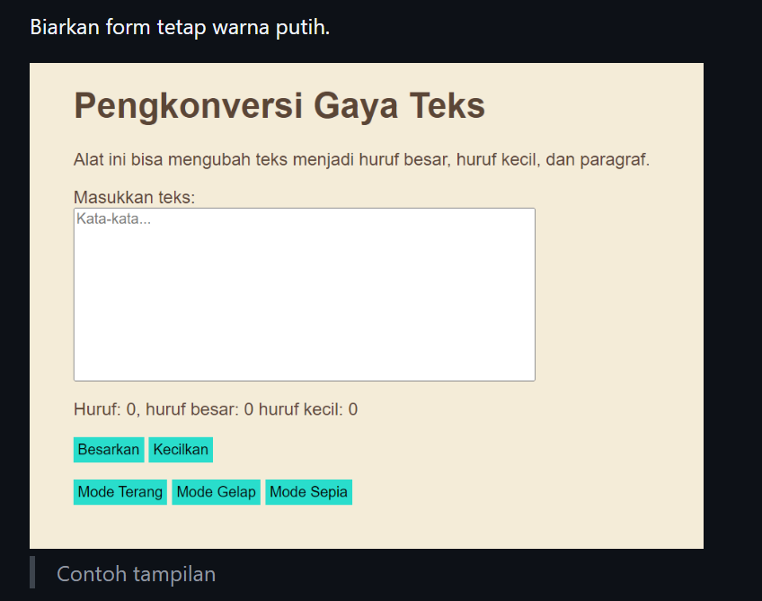
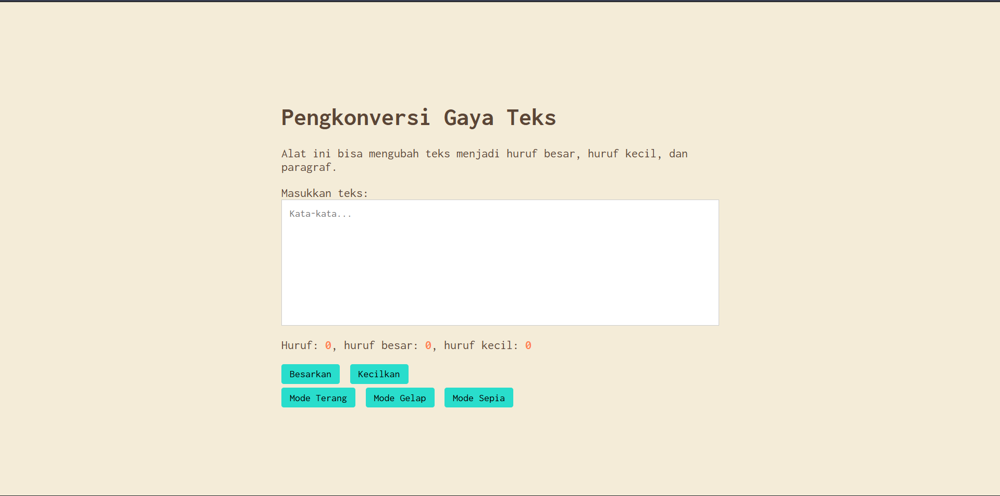

# Tugas Mandiri: Automata dan Table-Driven Construction

Muhammad Akbar Ivanka

103122400069

SE-08-02

Dosen Pengampu: Yudha Islami Sulistiya

Asisten Praktikum: Adhiansyah Muhammad Pradana Farawowan, Hamid Khaeruman

## Soal

Tambahkan mode sepia dengan ketentuan:

Elemen	Warna
Latar belakang	#F4ECD8
Warna teks	#5B4636
Biarkan form tetap warna putih.

Ketentuan lainnya:

Bagian mode-div harus menaungi tiga button: light, dark, dan sepia
Bisa berpindah state secara mulus: sepia menghasilkan sepia-mode, dark menghasilkan dark-mode, dan light menghasilkan light-mode

## Kode Sumber

Tersedia di [index.html](./index.html), [index.css](./index.css) dan [index.js](./index.js)

## Output

## Deskripsi

untuk pembaruan kode kali ini yaitu menambahkan Mode Sepia untuk melengkapi fitur gelap dan terang yg sudah ada dengan menambahkan tombol baru di HTML dan membuat class .mode-sepia di CSS. untuk bagian JS, saya memasukkan logikanya ke dalam satu fungsi khusus bernama gantiMode(). fungsi ini untuk menghapus class tema lama yg sedang aktif di body, setelah itu baru memasukkan class tema yg baru setiap kali tombol diklik.

selain itu, karena ada ketentuan lainnya yaitu disuruh untuk transisi yang mulus, maka saya menambahkan properti di CSS transition yg berduraasi 0.3 detik pada tiap elemen2 utama seperti body, kotak input, dan juga tombol2 nya. karena hal ini ketika mau mengubah tema maka akan ada transisi yg mulus semisal dari warna mode gelap ke mode sepia 