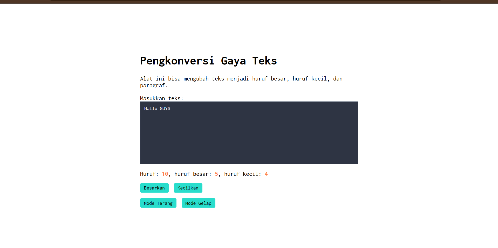

# Tugas Pendahuluan: Automata dan Table-Driven Construction

Muhammad Akbar Ivanka

103122400069

SE-08-02

Dosen Pengampu: Yudha Islami Sulistiya

Asisten Praktikum: Adhiansyah Muhammad Pradana Farawowan, Hamid Khaeruman

## Soal

Tambahkan mode gelap sekaligus untuk editor-kecil dan tombol-tombolnya. Ketentuan warna untuk latar belakang editor-kecil adalah #2e3443, sementara untuk tombol adalah #29ddcc. Teks untuk tombol tetap mengikuti warna teks sebelumnya.

Untuk menghapus pinggiran tombol, nyatakan properti border untuk tidak ditunjukkan.

## Kode Sumber

Tersedia di [index.html](./index.html), [index.css](./index.css) dan [index.js](./index.js)

## Output

## Deskripsi

seusai yg diminta soal, saya memperbarui kode kemarin buat nerapin state management untuk fitur mode gelap yang dibagi jadi tiga bagian. Pada bagian HTML, penambahan fitur ada pada dua tombol baru, yaitu "Mode Terang" dan "Mode Gelap", yang bertindak sebagai pemicu perubahan tema, beserta sedikit penyesuaian teks deskripsi biar sesuai dengan soal TP. terus di CSS, dibuat sebuah class baru bernama .mode-gelap untuk ngatur warna dasar halaman menjadi gelap dan teksnya menjadi terang. CSS ini juga memuat aturan bersarang yang membuat textarea berubah menjadi biru gelap (#2e3443) dan tombol tombol berubah menjadi toska (#29ddcc) tanpa garis pinggir ketika mode gelap tersebut sedang aktif.

Terakhir, dibagian JavaScript, logika interaksi dibangun dengan memasang event listener berjenis click pada kedua tombol tema tersebut. Tombol "Mode Gelap" diatur buat nyematin metode add pada class .mode-gelap secara langsung ke elemen akar HTML (document.documentElement), sedangkan tombol "Mode Terang" bertugas mencabutnya menggunakan metode remove. Dengan kata lain, efek mode gelap dan terang ini sepenuhnya dikendalikan melalui manipulasi class pada dokumen HTML