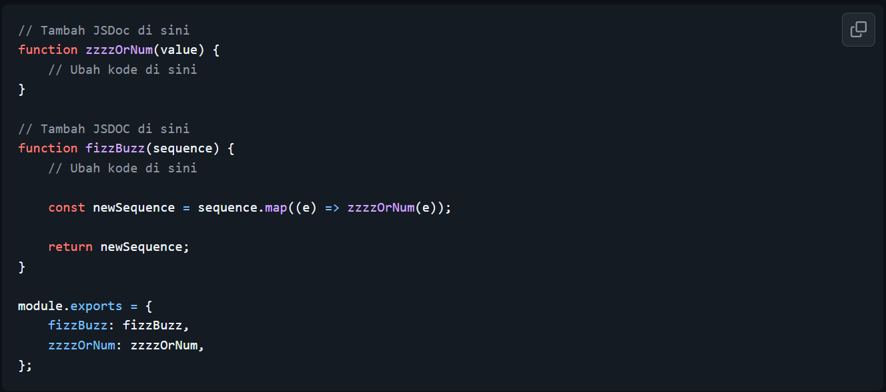
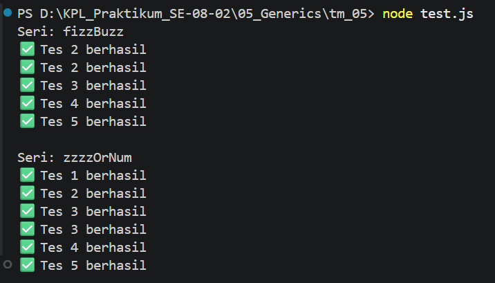
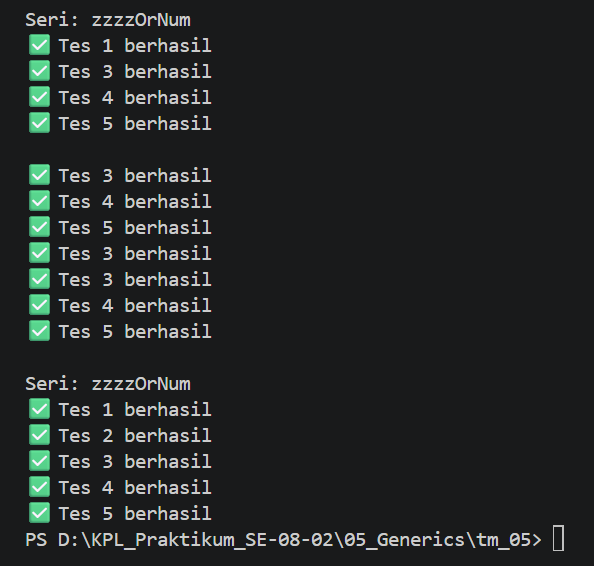

# Tugas Mandiri: Generics

Muhammad Akbar Ivanka

103122400069

SE-08-02

Dosen Pengampu: Yudha Islami Sulistiya

Asisten Praktikum: Adhiansyah Muhammad Pradana Farawowan, Hamid Khaeruman

## Soal

Diberikan program index.js seperti ini:

Aturan FizzBuzz kali ini adalah:

1. Fungsi fizzBuzz hanya menerima larik yang semua elemennya terdiri dari bilangan bulat dan mengeluarkan larik pula yang bisa jadi bercampur string dan bilangan
2. Fungsi zzzzOrNum hanya menerima sebuah data tunggal berupa bilangan bulat dan mengembalikan "Fizz", "FizzBuzz", "Buzz", atau bilanga bulat sesuai logikanya
3. Kedua fungsi harus ada dan harus disertai JSDoc sesuai tipe data yang disiratkan dari no. 1, no. 2, dan perilaku yang diharapkan di bawah
4. fizzBuzz harus menggunakan fungsi zzzzOrNum di dalamnya

## Kode Sumber

Tersedia di [test.js](./test.js), [fizz.js](./fizz.js) dan [tsconfig.json](./tsconfig.json)

## Output

## Deskripsi

untuk penjelasan perubahan kode pada program FizzBuzz ini yaitu ada penambahan pada anotasi JSDoc pada kedua fungsi untuk membatasi tipe data masukkan dan keluaran biar mematuhi mode strict pada (tsconfig.js). Untuk fungsi (zzzzOrNum), disini parameter ditetapkan sbg (number) dan nilai kembalian sbg (string|number), lalu di implementasikan ke logika modulo dgn pengecekan kelipatan 15 kali di urutan pertama biar ngga tumpang tindih dgn kelipatan 3 dan 5. Sementara itu, pada fungsi fizzBuzz, parameter didefinisikan sebagai number[] yang akan menghasilkan keluaran (string|number)[].

kemudian, biar memenuhi skenario pengujian (assert.throws) yg ada di dalam file (test.js), adanya penambahan validasi data manual pada awal kedua fungsi. dengan menggunakan (typeof value !== "number") pada (zzzzOrNum) dan (!Array.isArray(sequence)) di FizzBuzz buat munculin pesan error dengan sengaja buat cegah semisal masukkannya ngga sesuai ketentuan.