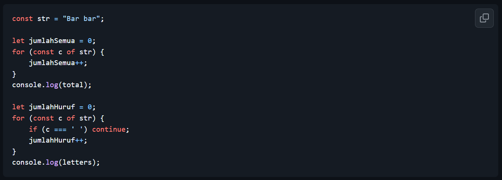
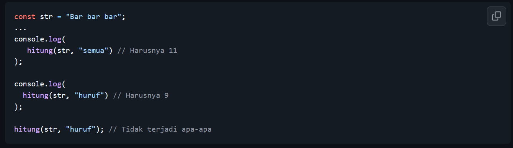
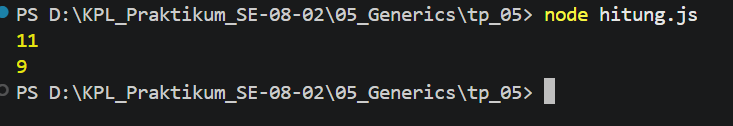

# Tugas Pendahuluan: Generics

Muhammad Akbar Ivanka

103122400069

SE-08-02

Dosen Pengampu: Yudha Islami Sulistiya

Asisten Praktikum: Adhiansyah Muhammad Pradana Farawowan, Hamid Khaeruman

## Soal

Ini adalah kode yang mengurus jumlah semua karakter dan jumlah huruf:

Bagaimana caramu hanya dengan satu fungsi generik bisa mengurus keduanya?

Agar fungsi yang kamu kerjakan benar atau tidak, berikut ini adalah kode tes yang bisa kamu tempelkan:

## Kode Sumber

Tersedia di [hitung.js](./hitung.js)

## Output

## Deskripsi

fungsi hitung ini dibuat menggunakan dua parameter yaitu tipe hitungannya ('semua' atau 'huruf'). didalammnya pakai looping for . . . of utk mengecek setiap karakter satu per satu. Kunci buat menggabungkan dua tugas tadi dengan kondisi if kalau tipenya 'huruf' dan karakternya itu spasi, programnya bakal jalanin continue buat ngeskip spasi tsb biar ngga masuk hitungan. jika diluar kondisi itu misalnya, kalau tipenya 'semua' atau karakternya bukan spasi, variabel penghitungnya akan terus bertambah. Setelah looping selesai, hasil akhirnya tinggal di return.