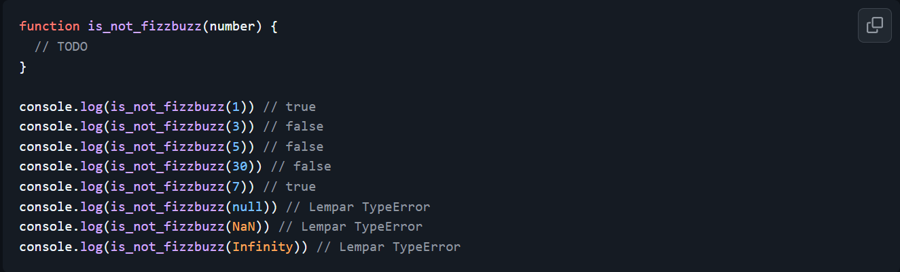
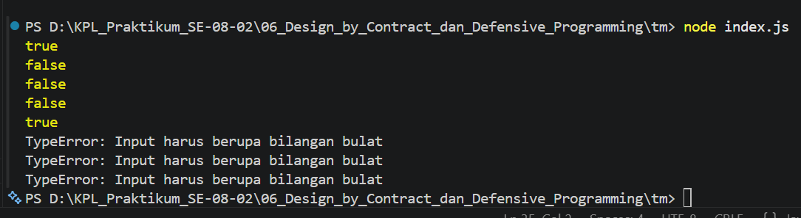

# Tugas Mandiri: Design by Contract dan Defensive Programming

Muhammad Akbar Ivanka

103122400069

SE-08-02

Dosen Pengampu: Yudha Islami Sulistiya

Asisten Praktikum: Adhiansyah Muhammad Pradana Farawowan, Hamid Khaeruman

## Soal

Lindungi kode ini dari bilangan-bilangan "fizz buzz"!

Tugasmu adalah membuat fungsi yang menolak bilangan-bilangan kelipatan 3, 5, atau 15, menerima bilangan-bilangan bukan "fizz buzz", dan melempar yang bukan bilangan bulat.

## Kode Sumber

Tersedia di [index.js](./index.js)

## Output

## Deskripsi

Fungsi is_not_fizzbuzz bekerja seperti penjaga pintu keamanan yang memiliki dua tahap pemeriksaan. Pada tahap pertama, fungsi ini memastikan bahwa data yang dimasukkan benar-benar sebuah bilangan bulat murni (bukan teks, angka desimal, maupun yg data kosong). Pengecekan ini dilakukan menggunakan kode !Number.isInteger(number). Jika input yang masuk ternyata salah tipe atau tidak valid, program akan langsung menghentikan proses di awal dan melempar pesan error (TypeError) biar sistem terhindar dari pemrosesan data yang rusak.

Setelah dipastikan aman, program masuk ke tahap kedua, yaitu untuk menyeleksi angka "fizz buzz" menggunakan perhitungan sisa bagi (modulo). Jika angka tersebut habis dibagi 3 atau 5 (ditulis dengan number % 3 === 0 || number % 5 === 0), program akan langsung menolaknya dengan mengembalikan nilai false. Jadi tidak perlu mengecek kelipatan 15 secara khusus karena otomatis sudah tersaring di tahap ini. Sebaliknya, jika sebuah angka biasa (seperti 1 atau 7) berhasil lolos dari kedua tahap pemeriksaan tersebut, barulah program mengeksekusi baris paling akhir yang mengembalikan nilai true, menandakan bilangan tersebut sah dan diterima.