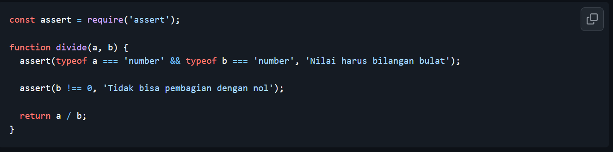
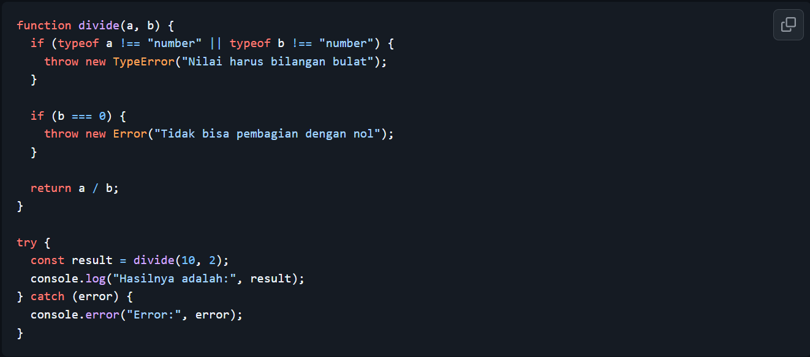
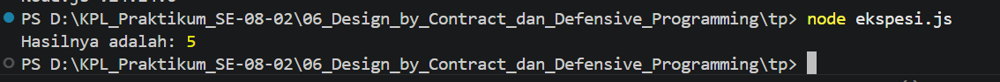

# Tugas Pendahuluan: Design by Contract dan Defensive Programming

Muhammad Akbar Ivanka

103122400069

SE-08-02

Dosen Pengampu: Yudha Islami Sulistiya

Asisten Praktikum: Adhiansyah Muhammad Pradana Farawowan, Hamid Khaeruman

## Soal

Diberikan dua kode yang sama-sama melakukan operasi pembagian. Pertama menggunakan asersi, kedua menggunakan eksepsi.

Menurutmu, kapankah kita saatnya menggunakan asersi atau eksepsi untuk fungsi seperti ini di atas? Apakah kita harus sepenuhnya asersi, atau sepenuhnya eksepsi? Lakukan riset dan berikan jawabannya dalam bentuk esai minimal 300 kata

## Kode Sumber

Tersedia di [asersi.js](./asersi.js) dan [ekspesi.js](./ekspesi.js)

## Output

## Deskripsi

Dalam Defensive Programming, asersi dan eksepsi sama sama memiliki peran yg penting buat melindungi sistem dari error, namun keduanya memiliki sebuah fungsi dan sasaran yang sangat berbeda. Oleh karena itu, kita tidak bisa hanya memilih salah satu keduanya justru harus dikombinasikan dan digunakan sesuai dengan porsinya masing masing.

Asersi merupakan alat diagnostik internal yang dirancang khusus buat programmer pada fase pengembangan (development) dan pengujian (testing). Saat menulis asersi, pengembang menetapkan aturan mutlak tentang logika kode. Jika aturan ini gagal terpenuhi, asersi akan membuat program langsung berhenti mendadak (crash fail-fast) dan memunculkan error teknis. Sifat kaku ini sengaja dibuat biar programmer langsung sadar dan memperbaiki cacat logika pada saat itu juga. Namun, asersi dilarang keras digunakan di tahap produksi (production) karena aplikasi yang sering tertutup paksa akan sangat merugikan kenyamanan pengguna.

Sebaliknya, eksepsi dirancang untuk beroperasi di dunia nyata saat program sudah berjalan (runtime) dan menghadapi anomali eksternal, seperti masukan pengguna yang keliru atau gangguan jaringan. Melalui perintah throw new Error yang ditangkap oleh blok try...catch, eksepsi mengelola kesalahan secara terstruktur tanpa mematikan program. Hal ini memungkinkan aplikasi memulihkan diri dan merespons dengan pesan peringatan yang ramah kepada pengguna.

Kesimpulannya, pembagian peran keduanya bergantung pada sumber masalah. Gunakan asersi jika untuk menangkap kesalahan logika yang murni disebabkan oleh programmer. Sedangkan di sisi lain,kita bisa menggunakan eksepsi untuk menangani kesalahan dinamis dari pengguna atau lingkungan biar aplikasi tidak rentan terjadi crash. Untuk fungsi pembagian yang menerima masukan langsung dari pengguna, memakai eksepsi adalah pilihan mutlak untuk menjaga aplikasi tetap hidup, sementara asersinya cukup dieksekusi di belakang layar pada saat tahap pengujian berlangsung. Dengan menggabungkan kedua pendekatan ini, kita tidak hanya memastikan kebenaran logika kode secara mutlak di tahap awal, tetapi hal ini juga menyajikan pengalaman pengguna yang mulus di garis depan. Hasil akhirnya adalah sebuah perangkat lunak yang jauh lebih tangguh, aman, dan juga dapat kita andalkan dalam menghadapi berbagai skenario dunia nyata.