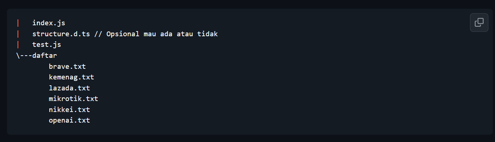
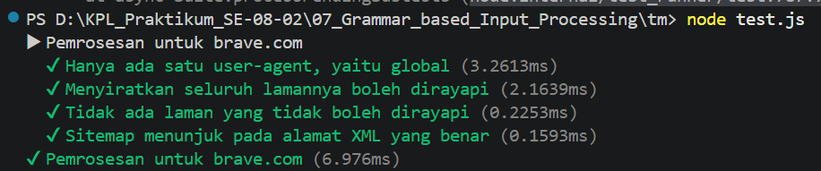
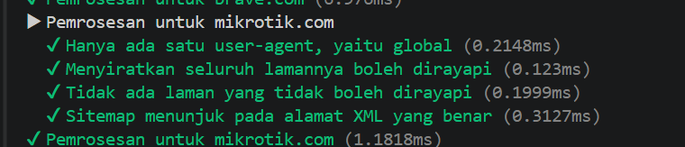
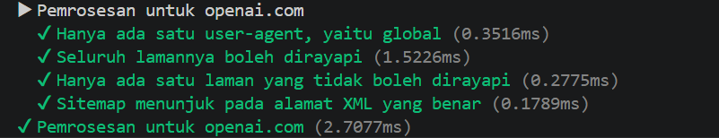
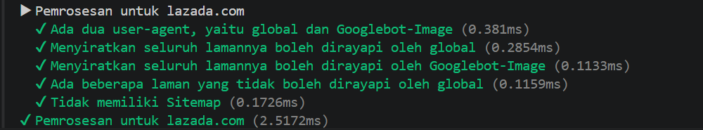
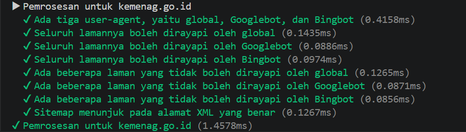
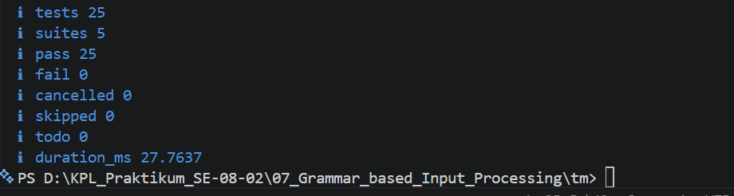

# Tugas Mandiri : Design by Contract dan Defensive Programming

Muhammad Akbar Ivanka

103122400069

SE-08-02

Dosen Pengampu: Yudha Islami Sulistiya

Asisten Praktikum: Adhiansyah Muhammad Pradana Farawowan, Hamid Khaeruman

## Soal

Tugas pada kesempatan kali ini adalah membuat fungsi yang menguraikan isi robots.txt menjadi POJO (plain old JavaScript object). Empat properti yang perlu diuraikan dijabarkan di bawah berikut.

User-agent adalah nama robot perayapnya
Allow adalah daftar halaman-halaman yang boleh dirayap
Disallow adalah daftar halaman-halaman yang tidak boleh dirayap
Sitemap adalah sebuah pranala yang menunjuk pada "denah" situs web (biasanya berformat XML)
Kamu akan mengerjakannya di dalam sebuah fungsi bernama parseRobots di index.js dan. Buka direktori 07 di sini untuk mengunduh berkas yang dimaksud, berkas-berikas robots.txt di dalam direktori daftar, dan berkas pengujiannya yaitu test.js.

Jadi, strukturnya harus seperti ini:

Agar kode yang kamu tulis di index.js bekerja atau tidak, jalankan test.js. Jika kamu membuat proyek Node (yang ada package.json), pastikan untuk membuat impor menjadi CommonJS dengan type: commonjs.

Beberapa petunjuk:

Manajemen state akan membantu
Nilai tambah jika kamu bisa mendeskripsikannya secara code tracing
Tidak perlu program untuk membaca TXT, itu sudah dilakukan oleh test.js
Hubungi asprak jika ada kendala atau kesalahan

## Kode Sumber

Tersedia di [index.js](./index.js) dan [test.js](./test.js)

## Output

## Deskripsi

Fungsi parseRobots bekerja dengan memecah keseluruhan teks menjadi baris per baris agar mudah diproses secara berurutan. Setiap baris kemudian dibersihkan dari spasi berlebih serta teks komentar yang diawali tanda pagar (#). Setelah bersih, program memotong baris tersebut pada bagian tanda titik dua (:) untuk memisahkan antara kata kunci (seperti user agent atau allow) dengan nilai aturannya.

Untuk mengelompokkan data, program menggunakan teknik manajemen status (state management) dengan cara "mengingat" nama agen perayap (user agent) yang sedang dibaca. Dengan begitu, setiap kali program menemukan aturan allow  atau disallow dibaris selanjutnya, aturan tersebut otomatis dimasukkan ke dalam kelompok agen yang sedang diingat tadi. Sementara itu, nilai dari kata kunci sitemap dan host akan langsung disimpan ke wadah global terpisah karena sifatnya berlaku umum untuk seluruh situs web.