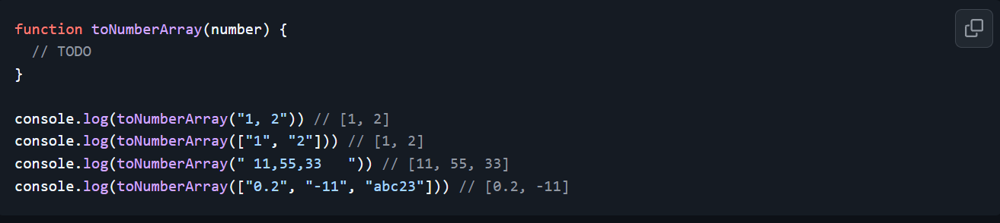
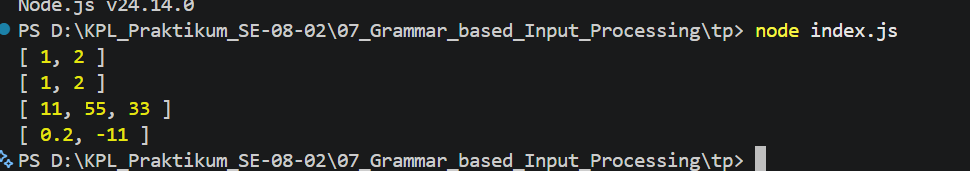

# Tugas Pendahuluan: Design by Contract dan Defensive Programming

Muhammad Akbar Ivanka

103122400069

SE-08-02

Dosen Pengampu: Yudha Islami Sulistiya

Asisten Praktikum: Adhiansyah Muhammad Pradana Farawowan, Hamid Khaeruman

## Soal

Buatlah fungsi yang mengubah deretan angka bertipe string menjadi larik angka.

## Kode Sumber

Tersedia di [index.js](./index.js) 

## Output

## Deskripsi

Fungsi toNumberArray ini ibarat sebuah mesin penyaring yang bertugas mengubah teks atau kumpulan kata acak menjadi daftar angka yang bersih dan rapi. Cara kerjanya dimulai dengan memeriksa data masukan; jika masukannya berupa teks panjang, fungsi ini akan memotong motongnya setiap kali bertemu tanda koma sehingga menjadi beberapa bagian terpisah. Setelah dipotong, setiap bagian teks tersebut langsung diubah menjadi wujud angka matematis sungguhan.

Proses pengubahan ini sangat praktis karena akan secara otomatis mengabaikan dan membersihkan spasi kosong yang tidak berguna. Sebagai langkah terakhir, fungsi ini melakukan penyaringan akhir dengan membuang bagian-bagian yang tidak masuk akal atau gagal dijadikan angka, seperti teks yang berisi huruf. Pada akhirnya, semua proses tersebut menghasilkan sebuah daftar baru yang murni hanya memuat deretan angka.