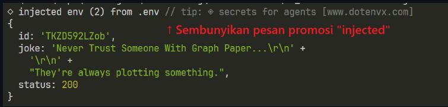
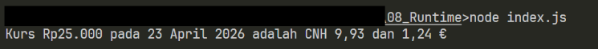
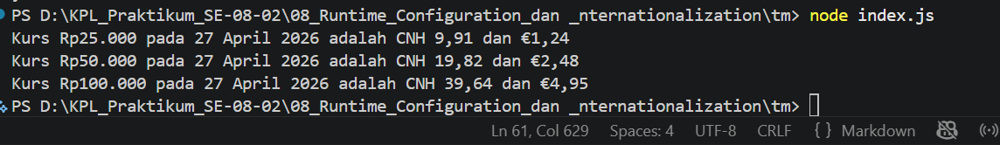

# Tugas Mandiri: Runtime Configuration dan Internationalization

Muhammad Akbar Ivanka

103122400069

SE-08-02

Dosen Pengampu: Yudha Islami Sulistiya

Asisten Praktikum: Adhiansyah Muhammad Pradana Farawowan, Hamid Khaeruman

## Soal

Pada tugas ini kamu akan membuat program yang menampilkan kurs rupiah (IDR) terhadap renminbi luar Tiongkok (CNH) dan euro (EUR). Gunakan link API ini untuk mengambil data.

Tantangan

1. Simpanlah URL API ke dalam .env sebagai BASE_API

2. Gunakan Intl untuk memformat nilai mata uang dan waktu kamu mengambil data kurs.

3. Hapus pesan promosi dotenv

Lalu pastikan outputnya tampak seperti di bawah ini.

Ujilah dengan Rp25000, Rp50000, dan Rp100000.

## Kode Sumber

Tersedia di [index.js](./index.js) & [.env](./.env) 

## Output

## Deskripsi

# Tugas Pendahuluan: Runtime Configuration dan Internationalization

Muhammad Akbar Ivanka

103122400069

SE-08-02

Dosen Pengampu: Yudha Islami Sulistiya

Asisten Praktikum: Adhiansyah Muhammad Pradana Farawowan, Hamid Khaeruman

## Soal

Tampilkan tanggal sekarang dengan format seperti ini:

Nilai waktu tidak harus sama, asalkan formatnya benar dan bisa tampil di komputer terpisah pada waktu tertentu. Gunakan Intl.DateTimeFormat (bukan string manual).

## Kode Sumber

Tersedia di [index.js](./index.js) & [.env](./.env)  

## Output

## Deskripsi

Kode tsb bekerja dalam tiga langkah yg sederhana. Pertama, program mengambil data waktu dan tanggal saat ini dari sistem komputer menggunakan perintah new Date(). kemudian yg kedua, program menyiapkan sebuah alat pemformat menggunakan Intl.DateTimeFormat yang secara khusus diatur ke setelan bahasa Indonesia ('id-ID'), beserta instruksi rincian untuk menampilkan nama hari secara utuh, angka tanggal, nama bulan utuh, dan angka tahun. Terakhir, alat pemformat tsb menerjemahkan data waktu mentah dari langkah pertama menjadi sebuah teks yang rapi sesuai dengan pengaturan tadi, lalu mencetak hasil akhirnya ke terminal.