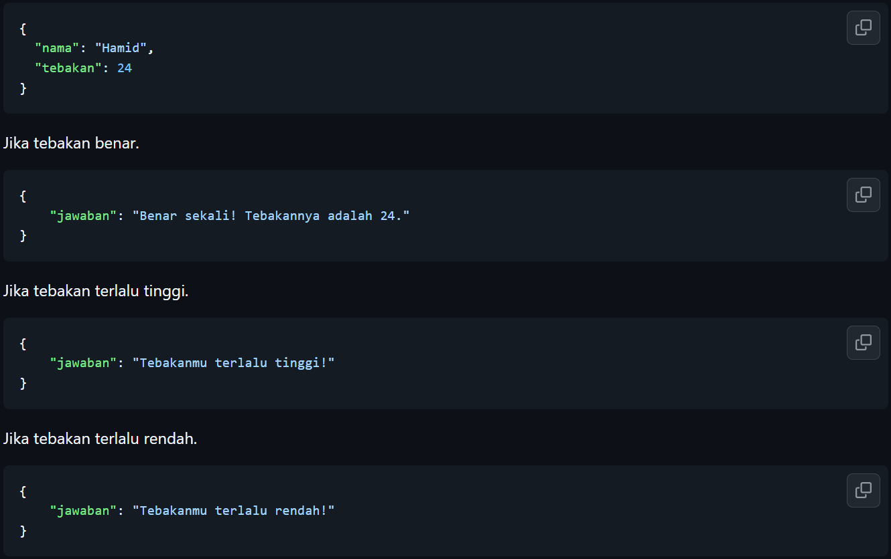
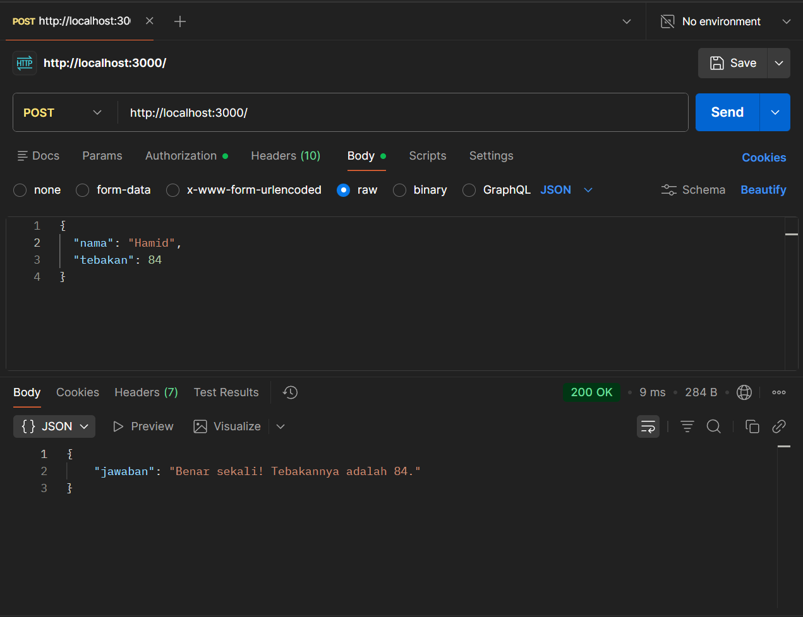
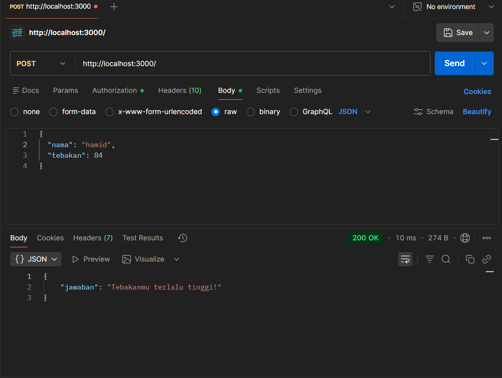
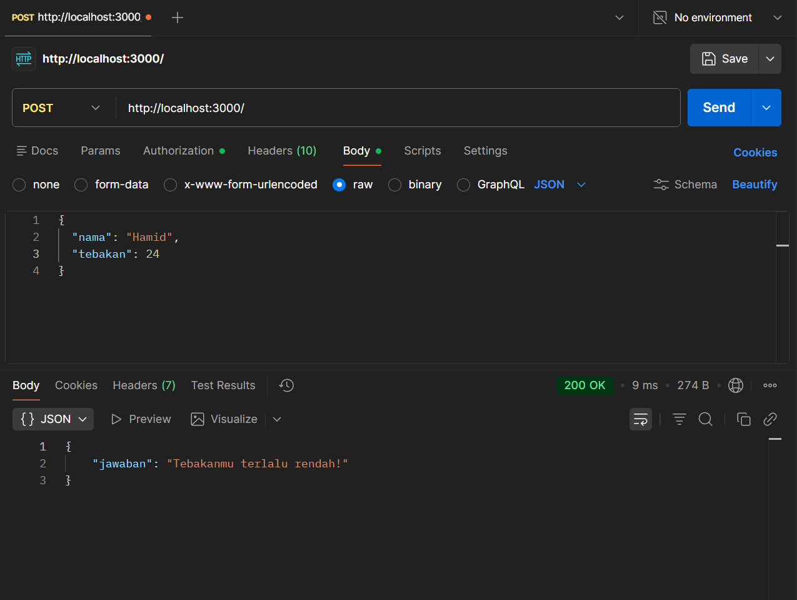
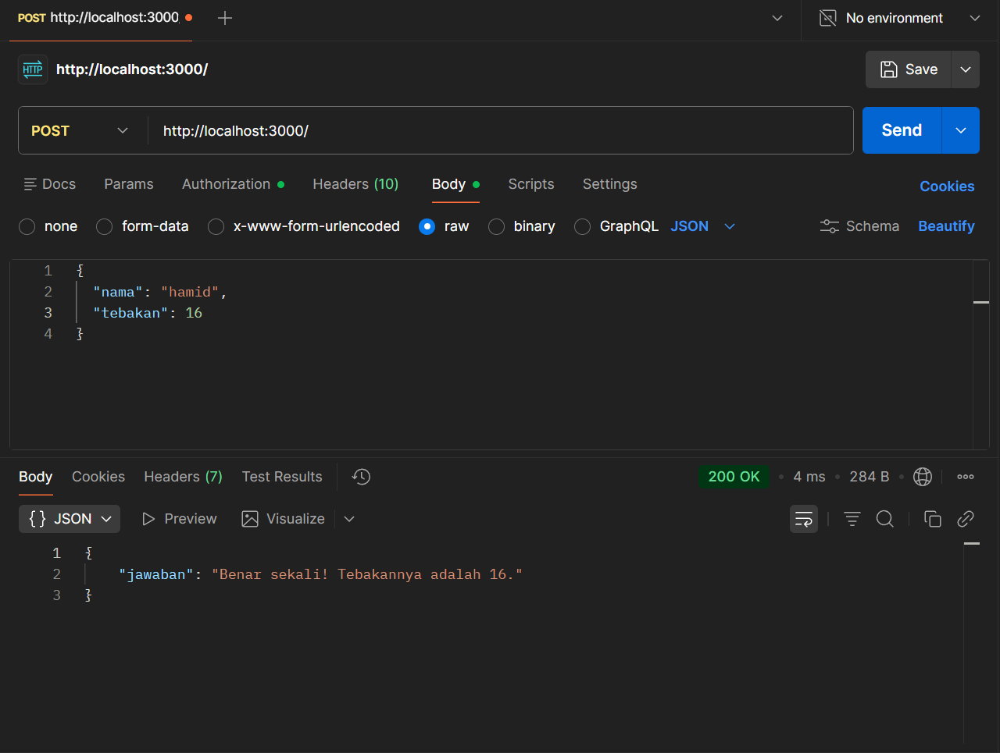

# Tugas Mandiri: API Design dan Construction Using Swagger

Muhammad Akbar Ivanka

103122400069

SE-08-02

Dosen Pengampu: Yudha Islami Sulistiya

Asisten Praktikum: Adhiansyah Muhammad Pradana Farawowan, Hamid Khaeruman

## Soal

Mari kita main tebak-tebakan angka acak!

Tugasmu adalah membuat API yang terdiri dari satu endpoint saja, yaitu POST /. Ketika kita melakkukan POST, formatnya adalah seperti di bawah ini.

Beberapa aturan:

1. Angka acak yang dihasilkan harus tetap dan tidak boleh berubah setiap kali permintaan API dilakukan, tetapi boleh berubah setiap harinya atau dibuat tetap selamanya
2. Rentang harus di antara 1-100
3. Nama harus sensitif terhadap besar kecil huruf (mis. hamid dan Hamid akan menghasilkan angka acak yang berbeda)
4. Tidak menggunakan pustaka apapun, murni mengandalkan nama dan tebakan

Penjelasan untuk nomor 1: Jika namanya Hamid, ia akan diharapkan tetap pada nilai tebakan 24 mau kamu melakukan 100 kali permintaan. Tidak ada jawaban benar di sini (Hamid tidak harus 24, bebas mau dibuat acak seperti apa yang penting harus tetap).

## Kode Sumber

Tersedia di [index.js](./index.js)

## Output

## Deskripsi

Kode yang udah dibuat merupakan sebuah program antarmuka (API) menggunakan Express.js yang disesuaikan dengan soal Tugas Mandiri buat menyelesaikan permainan tebak angka secara deterministik. API ini beroperasi pada metode POST dan bertugas menerima data masukan dalam format JSON yang berisi atribut nama serta angka tebakan. Agar sistem dapat menghasilkan angka rahasia yang selalu tetap untuk nama yang sama namun sensitif terhadap perbedaan huruf besar dan kecil seperti yg ada di aturan, programnya memanfaatkan perhitungan nilai karakter ASCII. Seluruh huruf penyusun nama tersebut dijumlahkan nilai ASCII-nya, kemudian diproses menggunakan operasi sisa bagi (modulo) seratus dan ditambah satu. Dengan menggunakan logika matematis ini bisa memastikan angka target selalu berada tepat di rentang satu hingga seratus tanpa harus menggunakan bantuan pustaka pengacak tambahan. Setelah angka target dikalkulasi, program akan langsung membandingkannya dengan angka tebakan yang dikirimkan dan memberikan balasan berupa status jawaban.

Kemudian, berdasarkan pada hasil keempat output yang ada di POSTMAN, Kelihatan jelas gimana sistem bisa merespons berbagai variasi masukan secara konsisten. Ketika nama diisi dengan awalan kapital "Hamid", maka total perhitungan karakternya akan selalu mengunci angka target di posisi 84, sehingga masukan tebakan 84 akan menghasilkan respons jawaban benar, sementara masukan angka 24 akan ditolak karena dianggap terlalu rendah. Di sisi lain, pembuktian aturan sensitivitas huruf terlihat saat nama diubah sepenuhnya menjadi huruf kecil "hamid". Perubahan satu huruf kapital menjadi kecil ini merombak total nilai ASCII, yang mengakibatkan angka target bergeser menjadi 16. Oleh karena itu, jika masukan namanya adalah "hamid" dan tebakannya 84, sistem dengan akurat akan menolaknya karena nilainya melampaui batas target, dan baru akan merespons jawaban benar jika tebakannya disesuaikan persis menjadi angka 16.