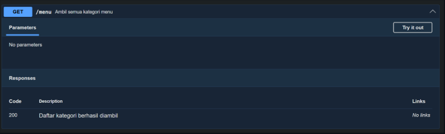
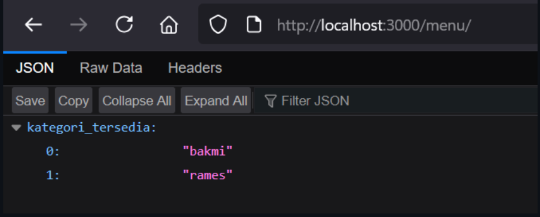
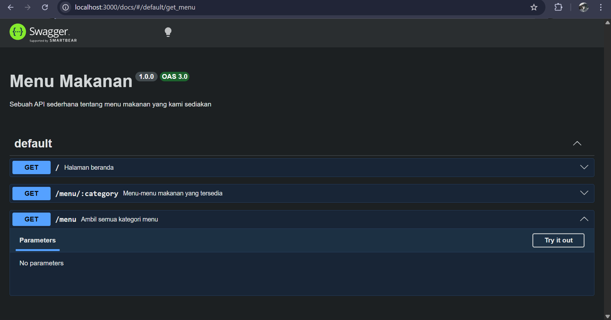
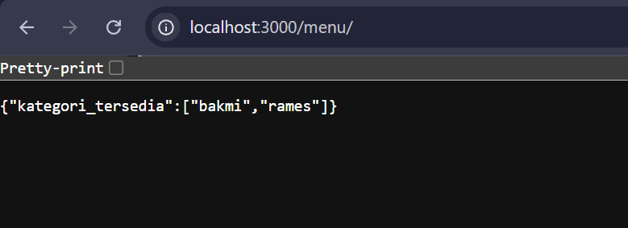

# Tugas Pendahuluan: API Design dan Construction Using Swagger

Muhammad Akbar Ivanka

103122400069

SE-08-02

Dosen Pengampu: Yudha Islami Sulistiya

Asisten Praktikum: Adhiansyah Muhammad Pradana Farawowan, Hamid Khaeruman

## Soal

Buatlah satu endpoint lagi beserta dokumentasi OpenAPI-nya, yaitu GET /menu yang menampilkan daftar semua nama kategori menu yang ada.

Dokumentasi:

Hasil GET:

## Kode Sumber

Tersedia di [index.js](./index.js) & Tersedia di [swagger.js](./swagger.js)

## Output

## Deskripsi

Pembaruan kode untuk menambahkan endpoint /menu dilakukan dengan menyisipkan fungsi app.get('/menu', ...) yang berfungsi mengekstraksi daftar kategori menu yang tersedia. Logika utamanya terletak pada penggunaan metode Object.keys(menuData) untuk mengambil nama-nama kunci dari objek data, yaitu "bakmi" dan "rames". Hasil ekstraksi tersebut kemudian dibungkus ke dalam properti kategori_tersedia dan dikirimkan sebagai respons dalam format JSON melalui perintah res.json(), sehingga output yang dihasilkan sesuai dengan struktur yang diminta pada modul.

Sisi dokumentasi juga diperbarui dengan menambahkan blok komentar JSDoc (/ @swagger ... */) tepat di atas rute tersebut untuk memicu pembuatan dokumentasi otomatis oleh Swagger UI. Penulisan dokumentasi dirancang minimalis guna menjaga kesesuaian visual dengan modul praktikum, yaitu hanya mencantumkan ringkasan berupa "Ambil semua kategori menu" dan definisi respons sukses untuk kode 200. Dengan mengikuti struktur ini, informasi pada halaman /docs tampil bersih tanpa tambahan parameter atau skema data rumit yang tidak diperlukan.