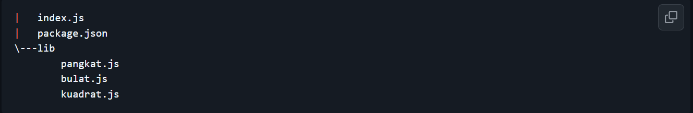
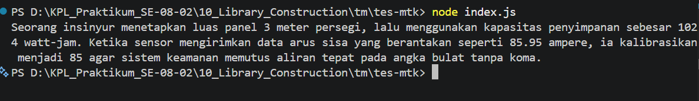

# Tugas Pendahuluan: API Design dan Construction Using Swagger

Muhammad Akbar Ivanka

103122400069

SE-08-02

Dosen Pengampu: Yudha Islami Sulistiya

Asisten Praktikum: Adhiansyah Muhammad Pradana Farawowan, Hamid Khaeruman

## Soal

Buatkan pustaka yang rapi!

Pada tugas ini buatlah sebuah proyek baru bernama mtk-gampang. Struktur proyeknya wajib diatur seperti di bawah ini.

Setiap berkas lib hanya memiliki satu fungsi saja.

1. pangkat.js berisi fungsi pangkat(x, y) yang mengembalikan nilai akhir dari x pangkat y.
2. bulat.js berisi fungsi bulat(x) yang mengubah bentuk bilangan non-bulat menjadi bulat (mis. -4.25 menjadi -4) .
3. kuadrat.js berisi fungsi kuadrat(x) yang mengembalikan nilai akar kuadrat 2 dari x.

Satu batasannya adalah fungsi-fungsi ini harus diakses dari index.js (sebagai nilai dari properti main), bukan dari lib masing-masing.

Jika sudah selesai, buatlah proyek baru lagi dan instal pustaka yang kamu buat secara lokal. Pada index.js-nya, gunakan kode ini untuk memastikan bahwa kamu berhasil melakukannya.

import { kuadrat, pangkat, bulat } from "libr";

const narasi = `Seorang insinyur menetapkan luas panel ${bulat(kuadrat(12))} meter persegi, lalu menggunakan kapasitas penyimpanan sebesar ${pangkat(2, 10)} watt-jam. Ketika sensor mengirimkan data arus sisa yang berantakan seperti 85.95 ampere, ia kalibrasikan menjadi ${bulat(85.95)} agar sistem keamanan memutus aliran tepat pada angka bulat tanpa koma.`;

/**
 * Seorang insinyur menetapkan luas panel 3 meter persegi, lalu menggunakan kapasitas penyimpanan sebesar 1024 watt-jam. Ketika sensor mengirimkan data arus sisa yang berantakan seperti 85.95 ampere, ia kalibrasikan menjadi 85 agar sistem keamanan memutus aliran tepat pada angka bulat tanpa koma.
 * /

console.log(narasi);

## Kode Sumber

Tersedia di [bulat.js](./mtk-gampang/lib/bulat.js), [pangkat.js](./mtk-gampang/lib/pangkat.js), [kuadrat.js](./mtk-gampang/lib/kuadrat.js), [index.js](./tes-mtk/index.js)
 & [index.js](./mtk-gampang/index.js)

## Output

## Deskripsi

kode kali ini merupakan implementasi hasil pengujian dari sebuah pustaka (library) JavaScript lokal yg bernama mtk-gampang sesuai instruksi soal yg memuat tiga fungsi matematika khusus : pangkat, bulat, dan kuadrat. Pada berkas pengujian tsb, ketiga fungsi kemudian diimpor dari pustaka dan dieksekusi langsung di dalam sebuah variabel teks bernama narasi dengan memanfaatkan fitur template literal/interpolasi string. Di dalam kalimat narasi tersebut, sistem melakukan tiga perhitungan matematis secara dinamis, fungsi kuadrat dan bulat digunakan bersamaan untuk mengonversi angka 12 menjadi nilai bulat 3, fungsi pangkat menghitung 2 pangkat 10 yang menghasilkan angka 1024, dan fungsi bulat kembali digunakan untuk membuang angka di belakang koma pada nilai 85.95 sehingga menjadi 85. Pada baris terakhir, fungsi console.log() dipanggil untuk mencetak keseluruhan kalimat yang datanya sudah terisi dengan hasil perhitungan tersebut ke layar terminal.