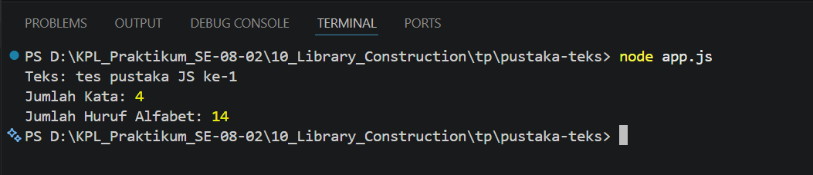

# Tugas Pendahuluan: API Design dan Construction Using Swagger

Muhammad Akbar Ivanka

103122400069

SE-08-02

Dosen Pengampu: Yudha Islami Sulistiya

Asisten Praktikum: Adhiansyah Muhammad Pradana Farawowan, Hamid Khaeruman

## Soal

Buatlah pustaka JavaScript yang menyediakan utilitas berupa dua fungsi yang menghitung jumlah huruf dan jumlah kata.

Kriteria:

1. Hanya alfabet A hingga Z yang dihitung (besar dan kecil)
2. Spasi tidak dihitung
3. Pustaka bisa diimpor

## Kode Sumber

Tersedia di [index.js](./pustaka-teks/index.js) & Tersedia di [app.js](./pustaka-teks/app.js)

## Output

## Deskripsi

Kode ini merupakan pustaka JavaScript sederhana yang mengekspor dua fungsi utilitas: hitungHuruf dan hitungKata. Fungsi hitungHuruf dirancang untuk mencari dan menghitung karakter alfabet (A-Z dan a-z) saja menggunakan bantuan Regex /[a-zA-Z]/g, sehingga angka, spasi, dan tanda baca otomatis diabaikan. Sementara itu, fungsi hitungKata bekerja dengan cara membersihkan teks dari spasi berlebih di awal dan akhir menggunakan trim(), lalu memecahnya menjadi kumpulan kata dengan Regex /\s+/ agar spasi ganda tidak merusak hitungan. Di bagian bawah, kode ini memvalidasi bahwa pustaka "bisa diimpor" dengan cara menarik kedua fungsi tersebut ke dalam file pengujian, lalu menjalankannya pada kalimat "tes pustaka JS ke-1" untuk membuktikan bahwa kodenya berjalan lancar sesuai permintaan soal.