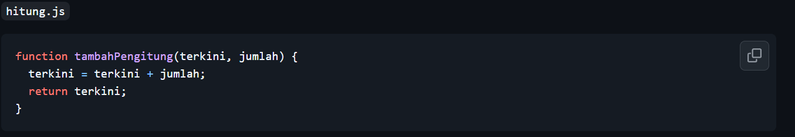
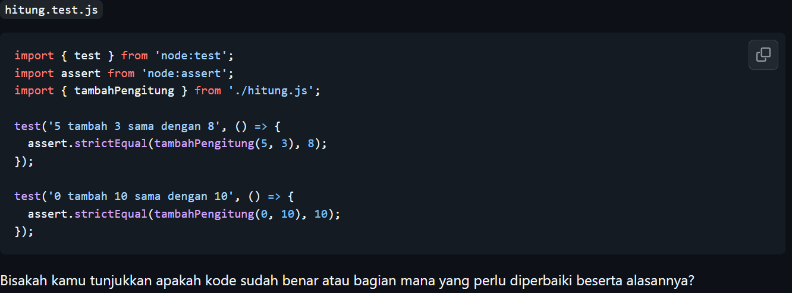
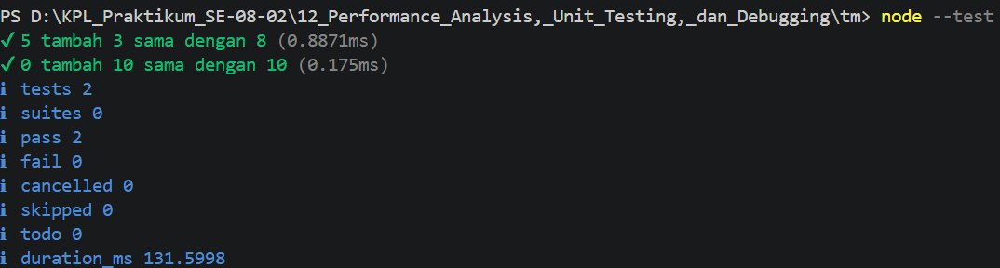

# Tugas Pendahuluan: Performance Analysis, Unit Testing, dan Debugging

Muhammad Akbar Ivanka

103122400069

SE-08-02

Dosen Pengampu: Yudha Islami Sulistiya

Asisten Praktikum: Adhiansyah Muhammad Pradana Farawowan, Hamid Khaeruman

## Soal
Tambah dan tambah!

Fungsi di bawah ini melakukan penjumlaha pada penghitung (counter), yang sesederhana menambahk jumlah jika kamu menekan tombol.

## Kode Sumber

Tersedia di [hitung.js](hitung.js) & [hitung.test.js](hitung.test.js) 

## Output

## Deskripsi

Secara logika perhitungan, kode fungsinya sebenarnya udah bener dan tidak ada masalah. Tapi, kalau kode tsb langsung dirun pasti akan error dan pengujiannya gagal. Bagian yg perlu diperbaiki ada pada file hitung.js, wajib menambahkan keyword export di bagian depan deklarasi fungsinya sehingga utk penulisannya menjadi export function tambahPengitung.

Alasan perbaikan ini cukup simpel. File pengujian yaitu hitung.test.js mencoba memanggil fungsi tersebut menggunakan perintah import. Nah, di dalam aturan Node.js, kode di dalam sebuah file itu sifatnya tertutup / private secara default. Jadi, kalau tidak menaruh kata export di file asalnya, file test tidak akan mengenali fungsi tersebut karena merasa tidak punya izin akses. Ibaratnya, penambahan export ini berfungsi sebagai "pintu" agar fungsinya bisa dibaca, ditarik, dan diuji oleh file lain.