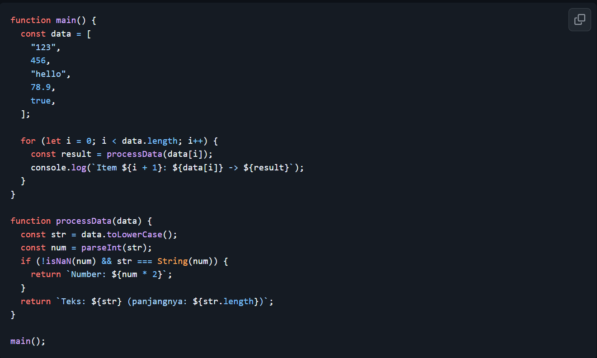
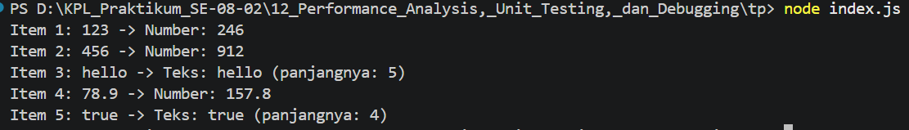

# Tugas Pendahuluan: Performance Analysis, Unit Testing, dan Debugging

Muhammad Akbar Ivanka

103122400069

SE-08-02

Dosen Pengampu: Yudha Islami Sulistiya

Asisten Praktikum: Adhiansyah Muhammad Pradana Farawowan, Hamid Khaeruman

## Soal

Cobalah untuk menangkap kecacatan dalam kode ini

## Kode Sumber

Tersedia di [index.js](index.js) 

## Output

## Deskripsi

Pada kode fungsi processData tsb, perubahan pertama yg dilakukan yaitu mengubah pemanggilan data.toLowerCase() menjadi String(data).toLowerCase(). karena jika diubah ke metode .toLowerCase() secara eksklusif hanya bisa digunakan pada tipe data String (teks). Ketika perulangan mencoba memanggil metode tersebut pada tipe data angka seperti 456 atau boolean seperti true, program akan memunculkan error TypeError dan berhenti secara paksa (crash). Dengan memaksa konversi input menjadi String terlebih dahulu, dengan memastikan bahwa seluruh elemen datanya tuh dapat diproses dengan aman tanpa memedulikan tipe data aslinya.

Perubahan kedua adalah mengganti penggunaan fungsi parseInt(str) menjadi Number(str) untuk memperbaiki kecacatan logika pada validasi angka. Alasan pengubahan ini adalah karena parseInt hanya berfungsi untuk membaca bilangan bulat, sehingga ia akan memotong dan menghilangkan nilai desimal pada angka seperti 78.9 menjadi 78 saja. Hal ini yg menyebabkan pengecekan keutuhan angka gagal, sehingga angka desimal tersebut malah salah diidentifikasi sebagai teks biasa. Dengan menggunakan fungsi Number(str), presisi angka desimal tetap utuh dan terjaga, sehingga program dapat mendeteksinya secara akurat sebagai Number dan melakukan operasi perkalian dengan benar.