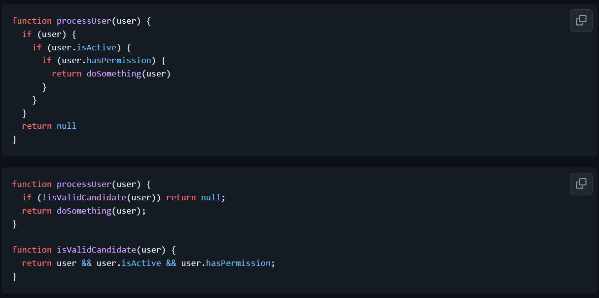

# Tugas Pendahuluan: Clean code

Muhammad Akbar Ivanka

103122400069

SE-08-02

Dosen Pengampu: Yudha Islami Sulistiya

Asisten Praktikum: Adhiansyah Muhammad Pradana Farawowan, Hamid Khaeruman

## Soal

Dari dua kode di bawah ini, mana yang kamu ingin cari masalahnya dan perbaiki di tengah-tengah malam, katakanlah jam 1 malam? Mengapa?

## Kode Sumber

Tersedia di [index.js](index.js) 

## Output

-

## Deskripsi

Jika harus mencari masalah dan memperbaiki kode pada jam 1 malam, mungkin saya sendiri lebih memilih kode yang kedua. karena waktu misal jam 1 pagi ketika tingkat konsentrasi sudah sangat menurun/ngantuk, kode pertama memiliki kondisi pengecekan yang bertumpuk ini akan memberikan beban kognitif yang tinggi karena memaksa untuk mengingat hierarki setiap kondisi. Sebaliknya, jika saya memilih kode kedua jauh lebih bersahabat karena menerapkan prinsip *guard clause* atau *early return*. Alur kodenya dapat dibaca layaknya kalimat biasa : jika *user* tidak valid, langsung hentikan proses dan kembalikan *null*. Hal ini membuat aksi utamanya alur keberhasilan berada di tingkat terluar dan tidak tersembunyi di dalam tumpukan pengecekan.

Selain itu, kode kedua mudah dikelola karena menerapkan pemisahan tanggung jawab yaitu *Single Responsibility Principle*. dimana Logika untuk memvalidasi syarat *user* diekstrak menjadi fungsinya tersendiri, yaitu `isValidCandidate()`. Pemisahan ini sangat memudahkan proses perbaikan di masa depan jika suatu saat ada syarat tambahan, jadi hanya perlu memodifikasi fungsi validasi tsb tanpa ada risiko merusak alur utama di dalam `processUser()`. dan Struktur yang bersih, deskriptif, dan rapi seperti ini akan sangat meminimalkan risiko kesalahan ketik, misal salah penempatan kurung kurawal ")" dan sangat menyelamatkan "developer" dari kebingungan saat harus *debugging* dalam keadaan lelah karena harus memperbaiki pada dini hari.