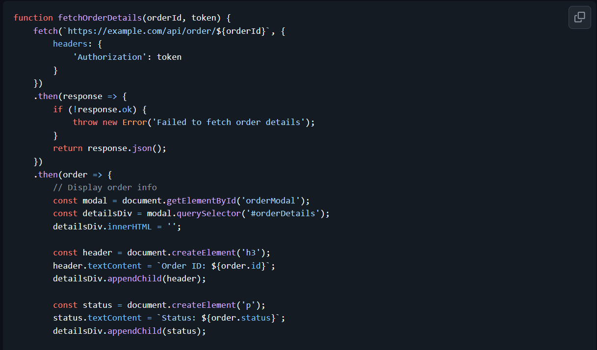
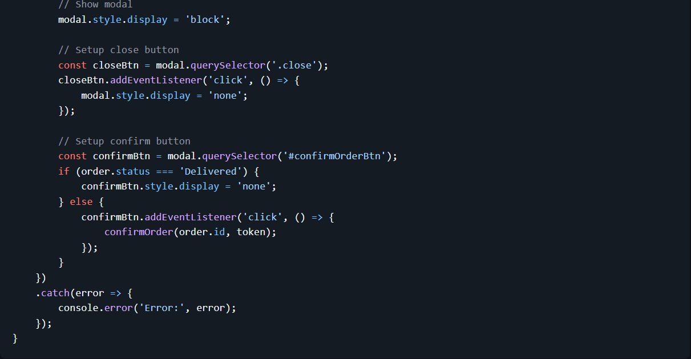

# Tugas Pendahuluan: Clean code

Muhammad Akbar Ivanka

103122400069

SE-08-02

Dosen Pengampu: Yudha Islami Sulistiya

Asisten Praktikum: Adhiansyah Muhammad Pradana Farawowan, Hamid Khaeruman

## Soal

Kode ini tampak baik dan bagus, tetapi menyalahi beberapa prinsip kode bersih. Bisakah kamu melakukan refaktorisasi? Dimodifikasi dari amrrwael/Delivery-website-Hits.

Sebagai konteks, fungsi di bawah ini menampilkan rincian pesanan di modal dan jika klik konfirmasi, sistem apa menyimpannya.

## Kode Sumber

Tersedia di [index.js](index.js) 

## Output

-

## Deskripsi

Refaktorisasi utama yang dilakukan adalah memecah satu fungsi yang terlalu besar menjadi beberapa fungsi spesifik berdasarkan prinsip SRP. Fungsi dipisah menjadi fetchOrderData khusus untuk memanggil API, renderOrderDetails untuk mengatur elemen antarmuka, dan setupConfirmButton untuk logika tombol. Selain itu, alur asinkron yang sebelumnya menggunakan rantai .then() diperbarui menjadi sintaks async/await biar kode lebih terstruktur, ringkas, dan penanganan error dapat dipusatkan menggunakan blok try...catch.

Perbaikan paling krusial untuk mencegah error ada pada penanganan aksi tombol. Pada kode sebelumnya, penggunaan addEventListener di dalam fungsi yang dipanggil berulang kali akan memicu penumpukan event, di mana jika satu klik bisa menyebabkan pengiriman data berkali kali. Masalah ini diselesaikan dengan mengganti addEventListener menjadi .onclick, sehingga aksi pada tombol selalu ditimpa dengan perintah terbaru tanpa menyebabkan eksekusi ganda atau kebocoran memori